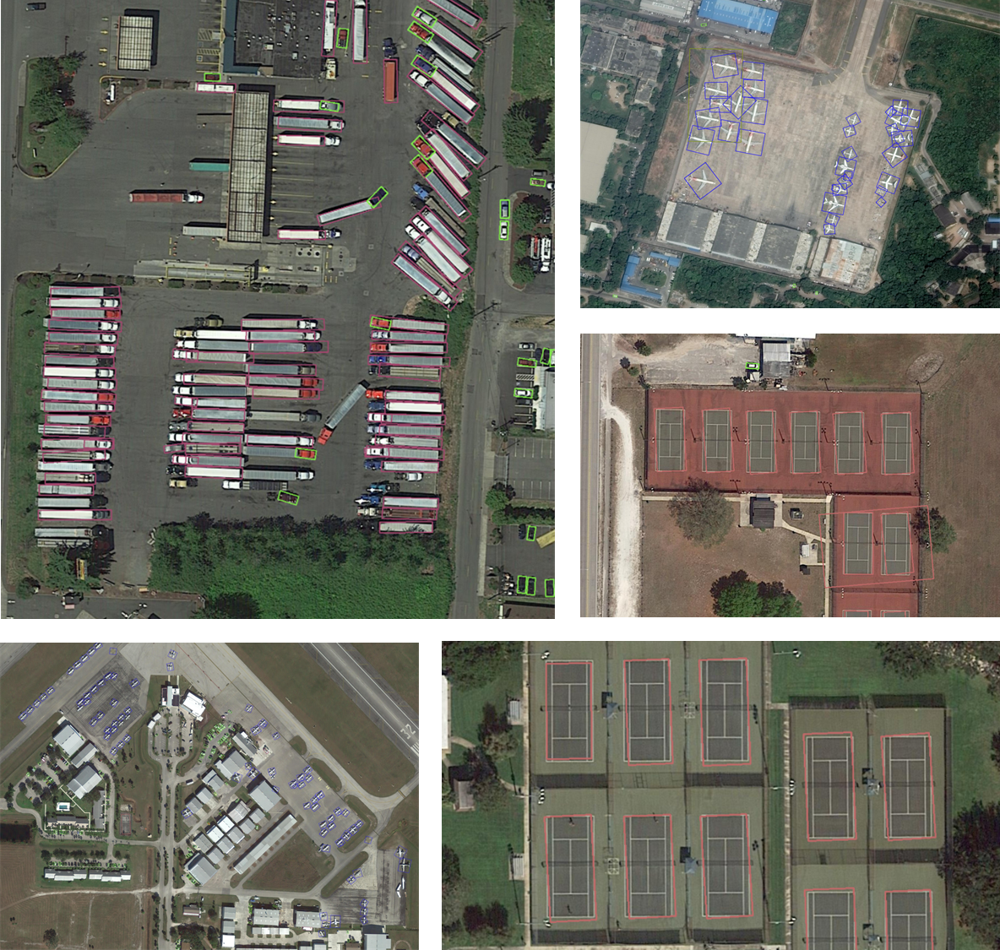

> Fall 2021 In Development

# Dota Leanring to Understand Aerial Image 2021 Challenge using Detectron2

> Goal: train a detector to detect the orientation of rotated objects in DOTAv2 Aerial Image 2021 Challenge

The project is for the __2021 Learning to Understand Aerial Images Challenge on DOTA dataset__ focused on training and benchmarking challenges for object detection in aerial images. 

This project development utilizes the [detectron2](https://github.com/facebookresearch/detectron2) as the main modeling framework. Additionally, all models utilize detectron2 baseline [model zoo](https://github.com/facebookresearch/detectron2/blob/master/MODEL_ZOO.md) models that contains the configs and models for transfer learning.

## Main Results - TBD

> TODO: need to run on test set

| Approaches                    | mAP | Plane | Ship | tank | harbor | helipad |
|------------                   |:---:|:-----:|:----:|:--:|:---:|:--:|
|Rotated_fasterrcnn  |TBD |    0.09| 0.57 | 0.18 | 0.0 | 0.0 |

### Summary Detections Results

_frcnn_X101 ckpt 20k_

## Getting Started

* [Installation_doc](docs/01_Installation.md) instructions
* [Dataset](docs/02_Dataset_Details.md) detail procedures for downloading and preparing the dataset
* To start training [Quickstart.md](docs/03_Quickstart.md)
* [Acknowledgements.md](docs/Acknowledgements.md)

